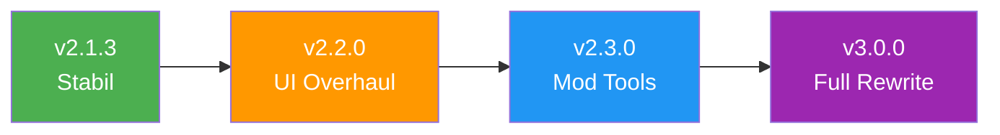

<h1 align="center">
  
  <br>
  GDIPS Reborn!
  <br>
  <sup><i>Geometry Dash Indonesia Private Server</i></sup>
</h1>

<p align="center">
  <b>Open-source GDPS yang dibangun bersama komunitas</b><br>
  <em>Setiap baris kode transparan (+_=) setiap kontribusi berarti</em>
</p>

<div align="center">

  
  
  
  
  
  
  

</div>

<div align="center">
  <sub>Dibuat dengan 💛 oleh komunitas Geometry Dash Indonesia</sub>
</div>

<br>

---

## 🖼 Preview

<div align="center">
  
  <br><br>
  
  <!-- Ganti dengan screenshot asli dashboard kamu -->
  
  <br>
  <sup><i>Screenshot dashboard — <a href="https://gdi.ps.fhgdps.com">Buka live demo</a></i></sup>
</div>

<br>

---

## 🌟 Kenapa GDIPS?

Banyak GDPS di luar sana. GDIPS beda karena:

| Aspek | GDIPS | GDPS Lainnya |
|-------|-------|-------------|
| Kode | 🔓 **Open-source** | 🔒 Closed-source |
| Kontribusi | 🤝 **Siapa saja bisa** | 👤 Hanya admin |
| Transparansi | ✅ **Penuh** | ❌ Minim |
| Komunitas | 🏠 **Indonesia-first** | 🌐 Umumnya global |
| Tujuan | 📚 **Belajar bersama** | 🎮 Main doang |

> *"Kami tidak membangun server sempurna. Kami membangun ekosistem where everyone can learn, break things, and improve together."*

---

## ⚡ Fitur

### 🎮 Untuk Pemain
- ✅ Upload & download level
- ✅ System daily/weekly levels
- ✅ Leaderboard real-time
- ✅ Custom song upload
- ✅ Gauntlet & map packs
- ✅ Friend system

### 🛠 Untuk Kontributor
- ✅ Kode terbuka sepenuhnya
- ✅ Arsitektur modular
- ✅ Dokumentasi lengkap
- ✅ Issue tracker aktif
- ✅ Code review dari maintainer
- ✅ Lingkungan belajar yang ramah

### 🔧 Untuk Host
- ✅ Mudah di-deploy (XAMPP/cPanel/VPS)
- ✅ Dokumentasi setup detail
- ✅ Database migration ready
- ✅ Konfigurasi fleksibel

---

## 🚀 Quick Start

### 📥 Download & Main

> **Mau langsung main?** [Download di sini](https://gdips.pages.dev/download)

### 🖥 Self-Host

```bash
# 1. Clone repo
git clone https://github.com/flessan/GDIPS.git
cd GDIPS

# 2. Setup database
# Import database/gdips.sql ke MySQL

# 3. Edit konfigurasi
cp config/example.config.php config/config.php
# Sesuaikan DB_HOST, DB_NAME, DB_USER, DB_PASS

# 4. Arahkan web server ke folder ini
# XAMPP: taruh di htdocs/gdips
# VPS: setup virtual host

# 5. Selesai! Buka di browser
```

<details>
<summary>📖 Panduan Setup Detail (klik untuk expand)</summary>

#### Prasyarat
- PHP 7.4+ (direkomendasikan 8.0+)
- MySQL 5.7+ / MariaDB 10.3+
- Web server (Apache/Nginx)
- Modul PHP: `pdo_mysql`, `mysqli`, `json`, `mbstring`, `curl`, `gd`

#### Langkah XAMPP (Windows)
```
1. Install XAMPP
2. Start Apache & MySQL
3. Buka http://localhost/phpmyadmin
4. Buat database baru: "gdips_db"
5. Import file database/gdips.sql
6. Copy folder GDIPS ke C:\xampp\htdocs\
7. Edit config/config.php
8. Buka http://localhost/GDIPS
```

#### Langkah VPS (Ubuntu)
```bash
sudo apt update
sudo apt install apache2 mysql-server php libapache2-mod-php php-mysql php-mbstring php-curl php-gd php-xml
sudo systemctl enable apache2 mysql
sudo mysql_secure_installation

# Setup database
sudo mysql -u root -p
CREATE DATABASE gdips_db;
CREATE USER 'gdips'@'localhost' IDENTIFIED BY 'password_aman';
GRANT ALL ON gdips_db.* TO 'gdips'@'localhost';
FLUSH PRIVILEGES;
EXIT;

# Clone & setup
cd /var/www/html
sudo git clone https://github.com/flessan/GDIPS.git gdips
sudo chown -R www-data:www-data gdips
cd gdips
cp config/example.config.php config/config.php
nano config/config.php
```

</details>

---

## 📁 Struktur Project

```
GDIPS/
├── 📂 database/              # SQL schema & migrations
│   ├── gdips.sql             # Schema utama
│   └── updates/              # Migration files
│
├── 📂 dashboard/             # Web dashboard (frontend)
│   ├── index.php
│   ├── levels.php
│   ├── upload.php
│   ├── css/
│   │   ├── style.css
│   │   └── responsive.css
│   └── js/
│       ├── main.js
│       └── utils.js
│
├── 📂 api/                   # Backend API endpoints
│   ├── getGJLevels.php
│   ├── uploadGJLevel.php
│   ├── login.php
│   └── ...
│
├── 📂 tools/                 # Utility & experimental tools
│   ├── levelDecryptor.php
│   └── songValidator.php
│
├── 📂 songs/                 # Storage untuk uploaded songs
├── 📂 assets/                # Images, icons, resources
│
├── 📂 config/                # Konfigurasi
│   ├── example.config.php    # Template config
│   └── config.php            # Config aktif (gitignored)
│
├── 📂 docs/                  # Dokumentasi
│   ├── SETUP.md
│   ├── API.md
│   └── ARCHITECTURE.md
│
├── 📂 .github/               # GitHub configs
│   ├── ISSUE_TEMPLATE/
│   │   ├── bug_report.md
│   │   └── feature_request.md
│   ├── PULL_REQUEST_TEMPLATE.md
│   ├── FUNDING.yml
│   └── workflows/
│       └── welcome.yml
│
├── 📄 .gitignore
├── 📄 CONTRIBUTING.md        # Panduan kontribusi
├── 📄 CODE_OF_CONDUCT.md     # Kode etik
├── 📄 LICENSE                # GPL-3.0
├── 📄 SECURITY.md            # Kebijakan keamanan
└── 📄 README.md              # File ini
```

---

## 🗺 Roadmap

<div align="center">



</div>

### v2.1.3 — Stabil ✅ *(Sekarang)*
- [x] Core server functionality
- [x] Song upload system
- [x] Basic dashboard
- [x] Open-source release

### v2.2.0 — UI Overhaul 🔜 *(Next)*
- [ ] Redesigned dashboard
- [ ] Dark mode support
- [ ] Mobile-responsive layout
- [ ] Better level browsing

### v2.3.0 — Mod Tools 📋 *(Planned)*
- [ ] Advanced moderation panel
- [ ] Auto-mod system
- [ ] Audit logs
- [ ] Role management

### v3.0.0 — Full Rewrite 🔮 *(Future)*
- [ ] Modern PHP framework
- [ ] REST API architecture
- [ ] Plugin system
- [ ] Multi-language support

---

## 🔗 Links Penting

<div align="center">

| | Link | Deskripsi |
|---|------|-----------|
| 🎮 | [Download Game](https://gdips.pages.dev/download) | Download GDIPS client |
| 🌐 | [Live Server](https://gdi.ps.fhgdps.com) | Buka dashboard |
| 📊 | [Database Viewer](https://gdi.ps.fhgdps.com) | Lihat data server |
| 💻 | [Source Code](https://github.com/flessan/GDIPS) | Repo GitHub ini |
| 🏢 | [Organization](https://github.com/gmdips) | GDIPS Organization |
| ⭐ | [GDPSHub](https://gdpshub.com/gdps/2924) | Profil di GDPSHub |
| 🔧 | [GDI Portal](https://gdips.pages.dev) | Portal utilitas |

</div>

---

## 👥 Komunitas

<div align="center">

[](https://chat.whatsapp.com/Fmh5DoSjbWkBje0ab3RAEF)
&nbsp;
[](https://discord.gg/YyeZ2Sxjgf)
&nbsp;
[](https://www.reddit.com/r/GDIPS)

<br><br>

**Statistik Komunitas**


</div>

---

## 🤝 Kontributor

<div align="center">

**Terima kasih untuk semua yang sudah berkontribusi!**

<!-- Ini akan otomatis terisi dari githubcontributors -->
<a href="https://github.com/gmdips/site/graphs/contributors">
  
</a>

<br>

<sup>Ingin namamu ada di sini? <a href="https://github.com/flessan/GDIPS/blob/main/CONTRIBUTING.md">Mulai berkontribusi</a>!</sup>

</div>

<details>
<summary>📊 Detail Kontributor</summary>

| Kontributor | Role | Kontribusi |
|-------------|------|------------|
| [Fless](https://github.com/flessan) | Founder | Core architecture, backend, infra |
| [Zeroxy](https://github.com/zeroxy) | Co-Lead | Community management, moderation |
| [*Kamu?*](https://github.com/flessan/GDIPS/blob/main/CONTRIBUTING.md) | Contributor | ??? |

</details>

---

## 💰 Support

<div align="center">

**dukungan finansial membantu server tetap hidup**

[](https://tako.id/fless)
&nbsp;
[](https://saweria.co/thiosaputra)

<br><br>

<sup>💡 Cara support terbaik? <b>Star repo</b> dan <a href="CONTRIBUTING.md">kontribusi kode</a>!</sup>

</div>

---

## 📊 Star History

<a href="https://www.star-history.com/#flessan/GDIPS&type=date&legend=top-left">
 <picture>
   <source media="(prefers-color-scheme: dark)" srcset="https://api.star-history.com/svg?repos=flessan/GDIPS&type=date&theme=dark&legend=top-left" />
   <source media="(prefers-color-scheme: light)" srcset="https://api.star-history.com/svg?repos=flessan/GDIPS&type=date&legend=top-left" />
   
 </picture>
</a>

---

## ⚖ Lisensi

Proyek ini dilisensikan di bawah **GNU General Public License v3.0**

```
GDIPS Reborn - Geometry Dash Indonesia Private Server
Copyright (C) 2024 Fless & GDIPS Contributors

This program is free software: you can redistribute it and/or modify
it under the terms of the GNU General Public License as published by
the Free Software Foundation, either version 3 of the License, or
(at your option) any later version.
```

> **Artinya:** Kamu bebas menggunakan, memodifikasi, dan mendistribusikan kode ini — asal tetap open-source dan memberi kredit.

<details>
<summary>📖 Detail Lisensi</summary>

**Boleh:**
- ✅ Menggunakan untuk pribadi/komersial
- ✅ Memodifikasi kode
- ✅ Mendistribusikan versi modifikasi
- ✅ Fork dan buat project sendiri

**Wajib:**
- ⚠️ Tetap menyertakan lisensi asli
- ⚠️ Menyertakan source code jika didistribusikan
- ⚠️ Perubahan harus diberi tanda
- ⚠️ Menggunakan lisensi yang sama (GPL-3.0)

**Dilarang:**
- ❌ Menjadikan closed-source
- ❌ Menghapus credit pemilik asli
- ❌ Menuntut tanggung jawab atas kerusakan

</details>

---

## 💬 Closing

<div align="center">

> *"Open-source bukan soal kode gratis — soal kepercayaan, transparansi, dan keyakinan bahwa bersama kita membangun sesuatu yang lebih besar."*

<br>

**Setiap ⭐, setiap PR, setiap issue memiliki makna.**

💚 **Terima kasih sudah menjadi bagian dari perjalanan ini.** 💚

<br>


<sup><b>Free Code For Everyone :D</b></sup><br>
<sup>Star this repo & mulai kontribusi!</sup><br><br>

<a href="#top">⬆ Kembali ke atas</a>

</div>
